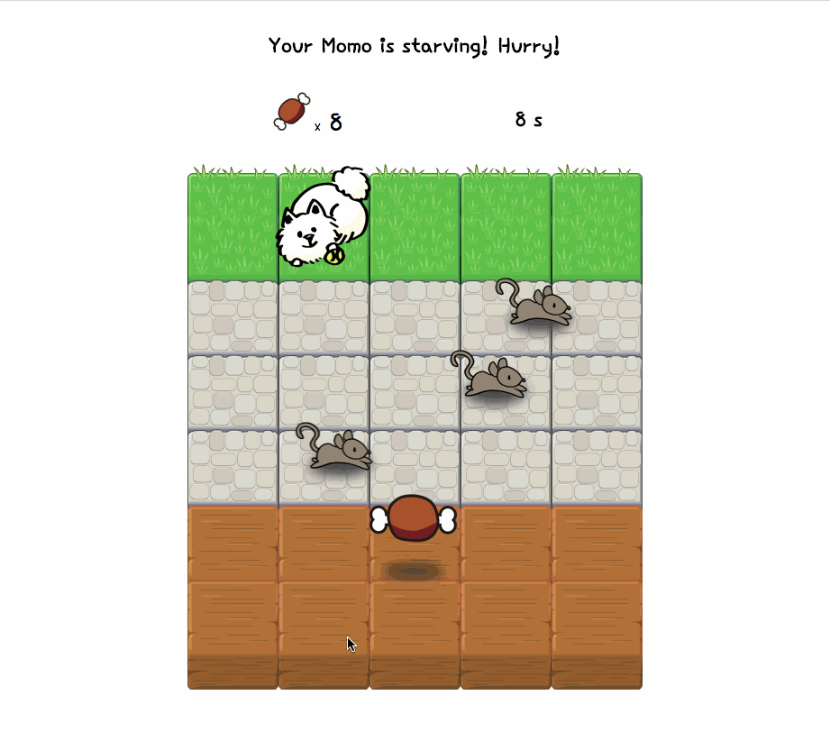

Feed Momo! A classic arcade game
===============================
Your Momo is starving! He is waiting for your meat! 

## How to play:
Please play this game on a computer! Use the arrow keys ←. ↑. →. ↓. on your keyboard to move the meat. The game starts immediately when you launch the page. Refresh the page to restart. To play this game locally, download the files and double click the `index.html`.

## How to win:
You have 20 seconds! Momo needs total of 10 meats! Protect the meat from crashing into the rats or you need to start over! Hurry, Momo is waiting! **Make Sure the meat __TOUCHES__ Momo.**

► [Play Game](https://daphnedeng.github.io/Feed-Momo/)
-----------------

### Preview:

## Created with:

- Object-Oriented Javascript
- HTML5 canvas
- jQuery
- CSS

#### Sources:
* [jQuery Popup Overlay](http://dev.vast.com/jquery-popup-overlay/)
* [Illust AC](https://www.ac-illust.com/)